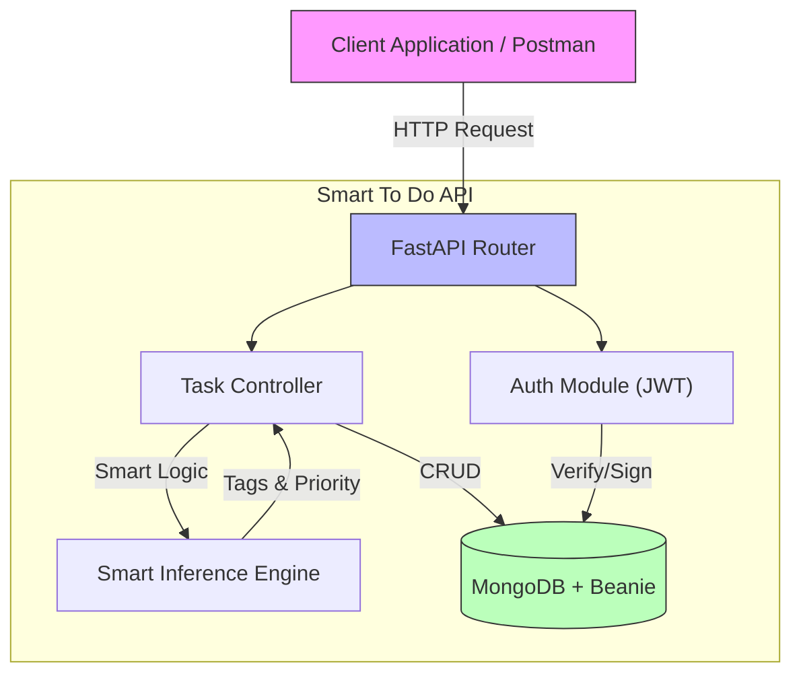

# Smart To Do API

A robust, user-centric, RESTful backend for task management suitable for user-friendly applications. Built with FastAPI, MongoDB (Motor + Beanie), and JWT Authentication.

## Features

- **Project Structure**: Modular, scalable architecture.
- **Security**: JWT Authentication, Password Hashing (Bcrypt).
- **Smart Features**:
  - Auto-tagging based on keywords (e.g., "buy" -> ["shopping"]).
  - Context-aware priority inference.
  - Friendly, clear error messages.
- **CRUD Operations**: Comprehensive pagination, filtering, and management.
- **Database**: Async MongoDB with Beanie DOM.

## 🏗️ Architecture



## 🛠️ Tech Stack

- **Framework**: FastAPI (Python 3.10+)
- **Database**: MongoDB (Async Motor driver)
- **ODM**: Beanie (Pydantic-based)
- **Authentication**: OAuth2 with Password Flow + JWT
- **Tooling**: `uv` (Fast Python Package Installer), `pytest` (Testing)

## 📚 Documentation

For detailed API usage and examples:

- 📖 **[API Documentation](API_DOCUMENTATION.md)**: Full endpoint reference, error codes, and schemas.
- � **[Project Blueprint](blueprint.md)**: Detailed breakdown of the development phases and architecture decisions.
- �🚀 **[Postman Collection](postman_collection.json)**: Import this file into Postman to test all endpoints instantly.

## Setup

1. **Clone the repository**:

   ```bash
   git clone https://github.com/saidulalimallick04/smart-to-do-api.git
   cd smart-to-do-api
   ```

2. **Environment Variables**:
   Create a `.env` file (or rename `.env.example`) with:

   ```env
   PROJECT_NAME="Smart To Do API"
   MONGODB_URL="mongodb://localhost:27017"
   DB_NAME="smart_todo_db"
   SECRET_KEY="YOUR_SECRET_KEY_HERE"
   ACCESS_TOKEN_EXPIRE_MINUTES=30
   REFRESH_TOKEN_EXPIRE_DAYS=7
   ALGORITHM="HS256"
   ```

3. **Execution Instructions (Recommended using `uv`)**:

   If you have `uv` installed, it's the fastest way to get started.

   ```bash
   uv sync
   uv run uvicorn main:app --reload
   ```

4. **Alternative Execution Instructions (Standard `pip`)**:

   If you prefer the standard workflow:

   **Create Virtual Environment**:

   ```bash
   python -m venv venv
   source venv/bin/activate  # On Windows: venv\Scripts\activate
   ```

   **Install Dependencies**:

   ```bash
   pip install -r requirements.txt
   ```

   **Run the Application**:

   ```bash
   uvicorn main:app --reload
   ```

## Testing

Run the test suite to verify functionality:

**Recommended (using `uv`)**:

```bash
uv run pytest
```

**Alternative (Standard)**:

```bash
pytest
```

## 📂 Project Structure

```bash
smart-to-do-api/
├── api/
│   └── v1/
│       └── endpoints/
│           ├── auth.py
│           └── tasks.py
├── core/
│   ├── config.py
│   ├── security.py
│   └── utils.py
├── db/
│   └── mongodb.py
├── models/
│   ├── task.py
│   └── user.py
├── schemas/
│   ├── task.py
│   ├── token.py
│   └── user.py
├── tests/
│   ├── conftest.py
│   ├── test_auth.py
│   └── test_tasks.py
├── main.py
├── pyproject.toml
├── requirements.txt
├── README.md
├── API_DOCUMENTATION.md
├── postman_collection.json
└── .env
```

---

## 👨‍💻 Author

| Profile | Developer Name | Role | GitHub | LinkedIn | X |
| :--- | :--- | :--- | :--- | :--- | :--- |
| [](https://github.com/saidulalimallick04) | Saidul Ali Mallick (Sami) | Backend Developer & AIML Engineer & Team Lead | [@saidulalimallick04](https://github.com/saidulalimallick04) | [@saidulalimallick04](https://linkedin.com/in/saidulalimallick04) | [@saidulmallick04](https://x.com/saidulmallick04) |

> ❤️ I believe in building impact, not just writing code.
> _💚 Backend Sage signing off.._
---
